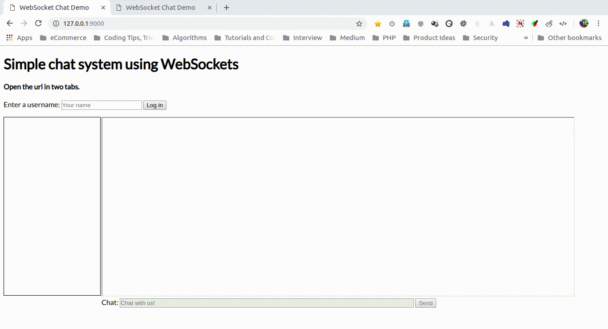

# Chat Implementation using WebSockets

### VSCode Configuration

VSCode is used to develop this application. Before starting the development,
VSCode should be configured to check code against Airbnb styleguide. This can be
done by following the article [Integrating Prettier + ESLint + Airbnb Style Guide
in VSCode](https://blog.echobind.com/integrating-prettier-eslint-airbnb-style-guide-in-vscode-47f07b5d7d6a).

## Installation

Open terminal and run below commands to install the package

```
git clone https://github.com/sumitpore/websockets-chat.git
cd websockets-chat
npm install
```

## Start WebSocket Server

After installation, we'll have to start the Websocket server. This can be done
by running the command

```
node server/chatserver-dist.js
```
This will start the WebSocket server on 8888 port.

## Using Chat

To interact with Chat system, we'll have to create a local server. To do that,
fire command

```
npm run start:dev
```
It will create a temporary server on port 9000. Open your browser and go to http://127.0.0.1:9000/
to access the Chat System.

## Code Structure

```bash
.
├── client - Code related to Browser
│   ├── chatclient-dist.js - Webpack transpiled code. index.html calls this file
│   ├── chatclient-src.js - Source file of chatclient-dist.js
│   ├── classes
│   │   ├── ResponseTypes - Contains classes to handle responses returned by Server
│   │   │   ├── AbstractResponseType.js - Main Abstract Class. Child classes extend this class
│   │   │   ├── ClientId.js
│   │   │   ├── Message.js
│   │   │   ├── Rejectusername.js
│   │   │   ├── Userlist.js
│   │   │   └── Username.js
│   │   ├── SendPayloadToServer - Contains classes related to data to be sent to server
│   │   │   ├── AbstractSendData.js - Main Abstract class. Child classes extend this.
│   │   │   ├── Message.js
│   │   │   └── Username.js
│   │   └── WebsocketConnection.js - Handles Sending/Receving data to/from WebSocket Server.
│   ├── helpers.js - Helper functions to handle frequently used information.
│   └── index.html - Main index.html file
├── common-functions.js - Functions used in both Server & Client code
├── .editorconfig - Editor configuration to be followed by Code Editors
├── .eslintrc.json - ES Lint Configuration
├── .gitignore - Files to be excluded from pushing into git repo
├── package.json - npm package file
├── .prettierrc - Prettier Config
├── readme.md - *YOU ARE READING THIS FILE
├── server - Code Related to WebSocket Server
│   ├── chatserver-dist.js - webpack transpiled code
│   └── chatserver-src.js - Original source code of chatserver-dist.js
├── .vscode
│   └── settings.json - VS Code Settings for this project.
└── webpack.config.js
```

## Screenshot


## ToDo
- [x] Use ES6
- [x] Follow AirBnB Coding Standards
- [x] Implement Basic Chat System
- [x] Apply Single Responsibility Principle on Client Side Code
- [ ] Apply SRP on Server Side Code
- [ ] Good User Interface
